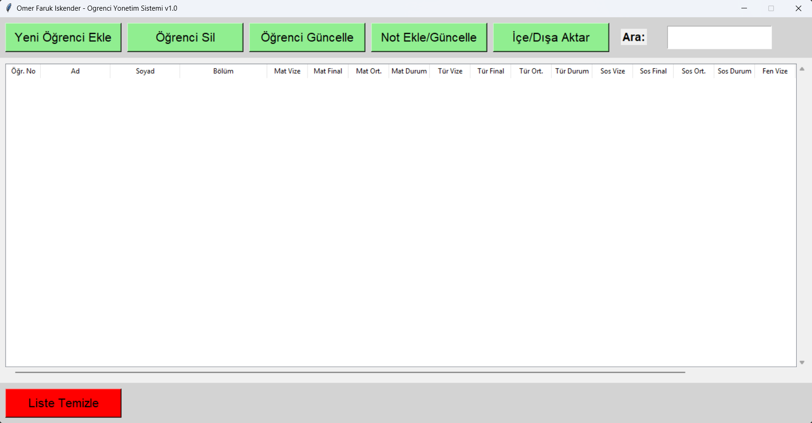

# 🎓 Öğrenci Yönetim Sistemi (Student Management System)

Bu proje, **Nesne Tabanlı Programlama** dersi kapsamında geliştirilmiş, masaüstü tabanlı kapsamlı bir öğrenci veri tabanı ve not takip uygulamasıdır. Python ve Tkinter kütüphanesi kullanılarak, kullanıcı dostu ve ölçeklenebilir bir yapıda tasarlanmıştır.


## 📸 Ekran Görüntüsü



## 🚀 Özellikler

Uygulama, eğitim kurumlarının ihtiyaç duyduğu temel veri yönetim süreçlerini dijitalleştirmektedir:

* **📇 Öğrenci İşlemleri (CRUD):**
    * Yeni öğrenci kaydı oluşturma, silme ve güncelleme.
    * Öğrenci numarası üzerinden mükerrer kayıt kontrolü.
* **📊 Dinamik Not Yönetimi:**
    * Matematik, Türkçe, Sosyal Bilgiler ve Fen Bilimleri dersleri için Vize/Final girişi.
    * **Otomatik Hesaplama:** Notlar girildiği an Ortalama hesaplanır ve "Geçti/Kaldı" durumu sistem tarafından atanır.
    * **Validasyon:** 0-100 aralığı dışındaki veya hatalı karakter girişlerinde sistem uyarı verir.
* **💾 Veri Transferi (Excel/CSV):**
    * **Dışa Aktar (Export):** Tüm listeyi `.csv` formatında, UTF-8 kodlamasıyla kaydeder.
    * **İçe Aktar (Import):** Akıllı algoritma sayesinde dışarıdan yüklenen dosyanın formatını otomatik algılar ve eksik sütunları onararak sisteme dahil eder.
* **🔍 Filtreleme ve Arama:**
    * İsim, soyisim veya numaraya göre anlık arama yapabilme.
* **📱 Duyarlı Tasarım (Responsive):**
    * Grid yerleşim sistemi sayesinde pencere boyutuna göre otomatik hizalanan arayüz.

## 🛠️ Kurulum ve Çalıştırma

Projeyi bilgisayarınızda çalıştırmak için:

1.  **Projeyi İndirin:**
    ```bash
    git clone [https://github.com/farukiskender/Ogrenci_Yonetim_Sistemi.git](https://github.com/farukiskender/Ogrenci_Yonetim_Sistemi.git)
    cd Ogrenci_Yonetim_Sistemi
    ```

2.  **Uygulamayı Başlatın:**
    Herhangi bir ek kütüphane kurulumuna ihtiyaç yoktur (Python standart kütüphaneleri kullanılmıştır).
    ```bash
    python main.py
    ```

## 📂 Dosya Yapısı

```text
├── main.py              # Uygulamanın ana kaynak kodu
├── okul.ico             # Arayüz ikon dosyası
├── ornek_veriler.csv    # Test için örnek veri seti
├── mainwindow.png       # GitHub'da görünecek ekran görüntüsü
└── README.md            # Proje dokümantasyonu
```

## 👤 Geliştirici
```
Ömer Faruk İskender

GitHub: https://github.com/farukiskender

LinkedIn: https://www.linkedin.com/in/farukiskender0/

Bu proje eğitim amaçlı geliştirilmiştir.
```
